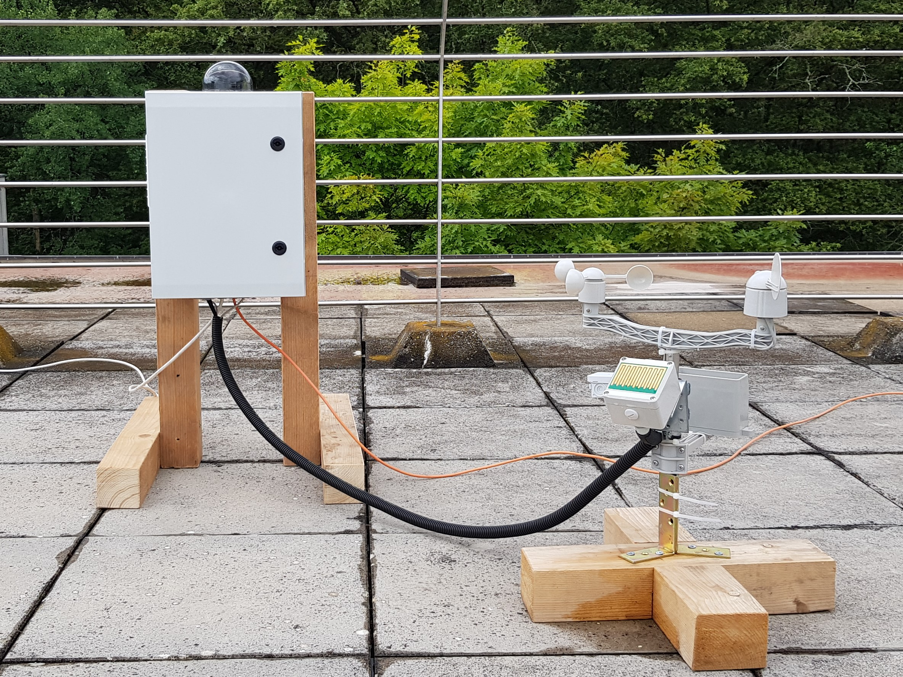
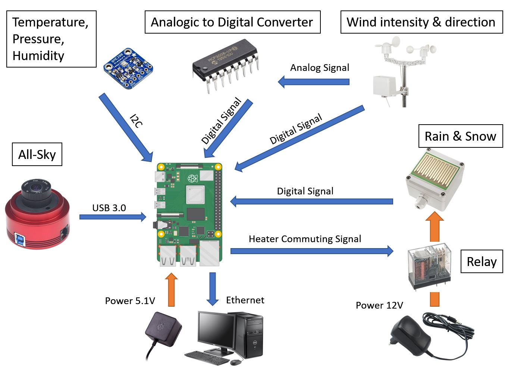
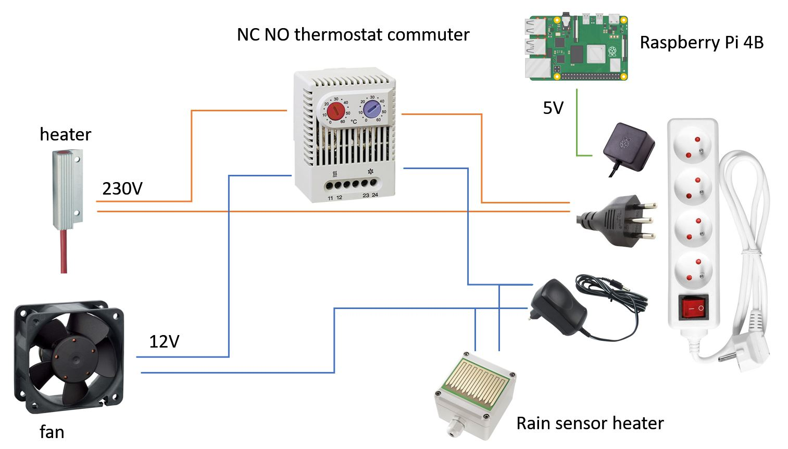
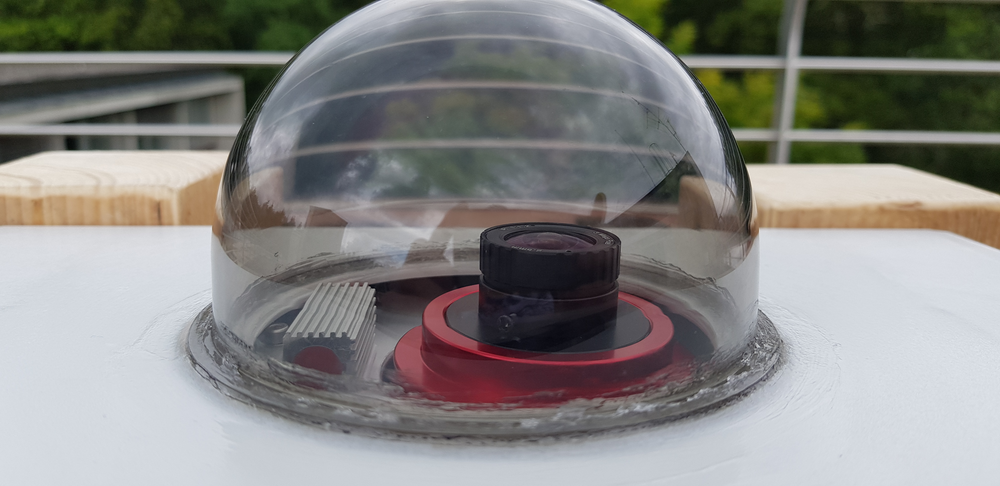
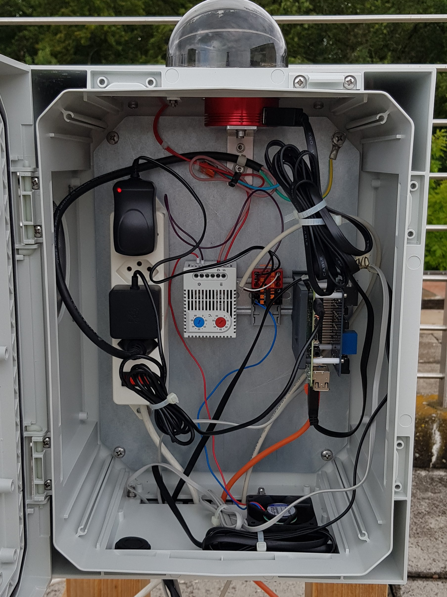

# TELESTO-weather-allsky
Repository for the code used to run the DIY weather station and All-Sky camera build for the Sauverny Observatory in the scope of a semester project.

## Code Structure
The code for this project can be divided into 3 main parts, each part is located in a specific directory on the Raspberry Pi 4:

* /home/pi/**weather**: This directory contains all the code necessary to run the weather station, generate plots and save the data.
* /home/pi/**allsky**: This directory contains all the code necessary to run the All-Sky camera.
* /var/www/**html**: This directory contains all the code necessary to run the lighttpd server.

## The setup of the weather station and All-Sky camera is the following :

## The camera and Raspberry Pi 4B case :
In this improved version, the Raspberry Pi and the All-Sky camera are now inside an electrical cabinet. The cabinet has more space and allows for active thermal regualtation. In my case, the cabinet has a NO NC thermostat used to toggle a heater and a fan. The wiring is the following :

## The ZWO Camera ASI 178 MM Mono with its 170° wide angle lens and nearby anti-fog heater:

## The inside of the electrical cabinet:

## Inspiration and Sources:

There are already several well written blogs and posts about the creation of all sky camera and weather stations. I highly recommend having a look at the two following:

* The excellent project of Thomas Jacquin which can be consulted on https://github.com/thomasjacquin/allsky
* The Raspberry Pi Fundation weather station project which is available at : https://projects.raspberrypi.org/en/projects/build-your-own-weather-station

Furthermore, Thomas Jacquin wrote an excellent software to run the ASI All-Sky camera and host the control and results on a small webpage. My project was heavily inspired from his work and several minor modification/improvements were add to his code (for example display the current weather on the webserver as the All-Sky images).
